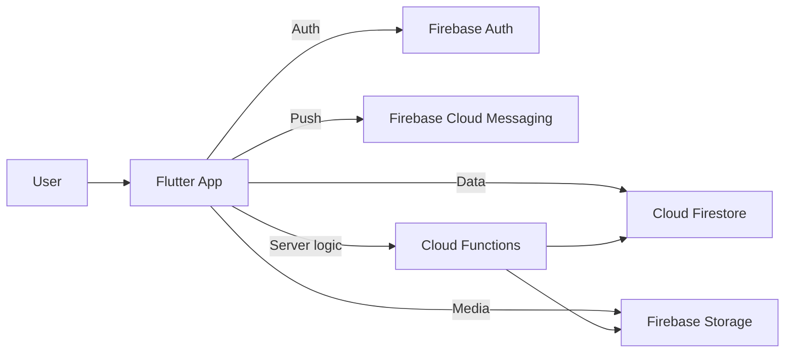
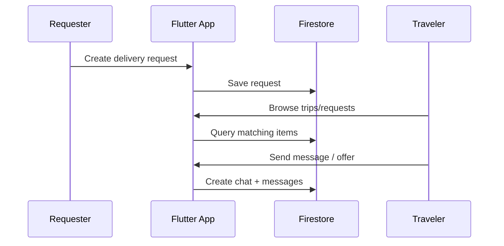

<div align="center">

# Diaspora Delivery — Diaspora Peer Delivery Mobile Application

A peer-to-peer delivery platform that connects diaspora members who want to send items to Ethiopia (**Requesters**) with travelers already going (**Travelers**).

[](https://flutter.dev/)
[](https://firebase.google.com/)
[](https://nodejs.org/)

</div>

This repository contains:

- **Flutter frontend**: `frontend/`
- **Firebase backend** (Cloud Functions + rules + emulators): `firebase/`
- **Product documentation** (SRS/SDA): `docs/`

---

## Quick links

- App (Flutter): `frontend/README.md`
- Cloud Functions (Firebase): `firebase/functions/`
- SRS/SDA document: `docs/Diaspora_Peer_Delivery_SRS_SDA_v1.0.0.md`

---

## Architecture (high level)



### Example flow: requester and traveler coordination



---

## Getting started

### Prerequisites

- Node.js (for Firebase emulators / functions)
- Firebase CLI (optional; the repo scripts use `npx firebase-tools`)
- Flutter SDK (Dart >= 3.0)

### Run backend locally (Firebase Emulator Suite)

From the repo root:

```bash
npm run install:functions
npm run serve:backend
```

This starts local emulators for Auth, Firestore, Functions, Storage, Pub/Sub, and the Emulator UI.

### Run the Flutter app

```bash
cd frontend
flutter pub get
flutter run
```

For emulator-friendly Flutter run commands, see `frontend/README.md`.

---

## Repo structure

- `frontend/` — Flutter application
- `firebase/` — Firebase config, security rules, emulators, Cloud Functions
- `docs/` — Requirements and architecture documentation

---

## Contributing

- Keep changes scoped and add tests where practical.
- Follow existing patterns for feature modules (`frontend/lib/features`).
- Prefer running against the emulator suite for development.

---

## License

If you plan to publish this repository, add a LICENSE file and update this section.
