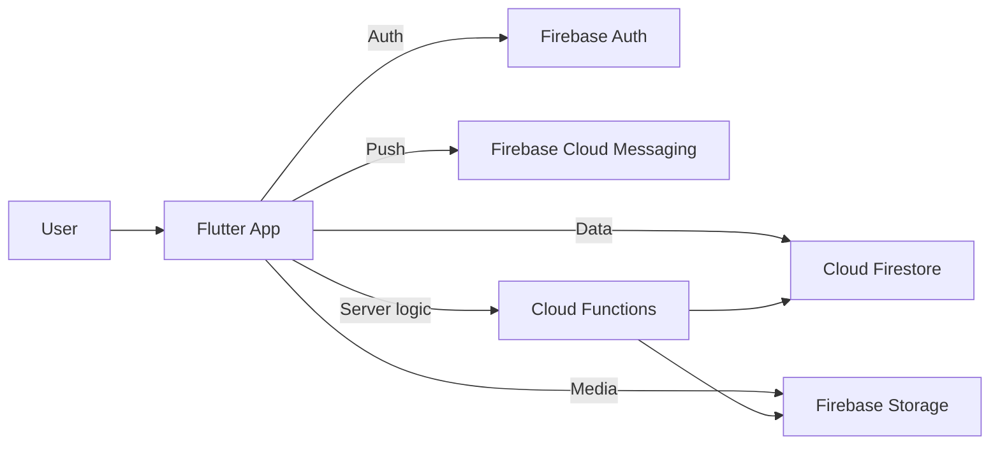
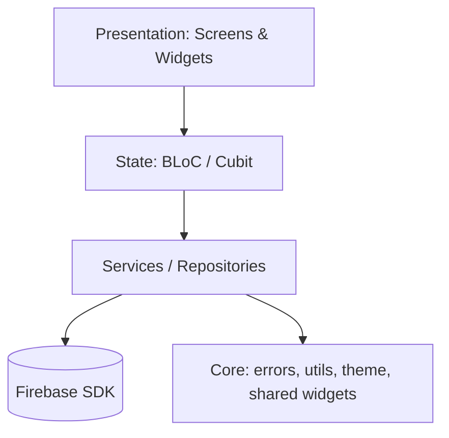
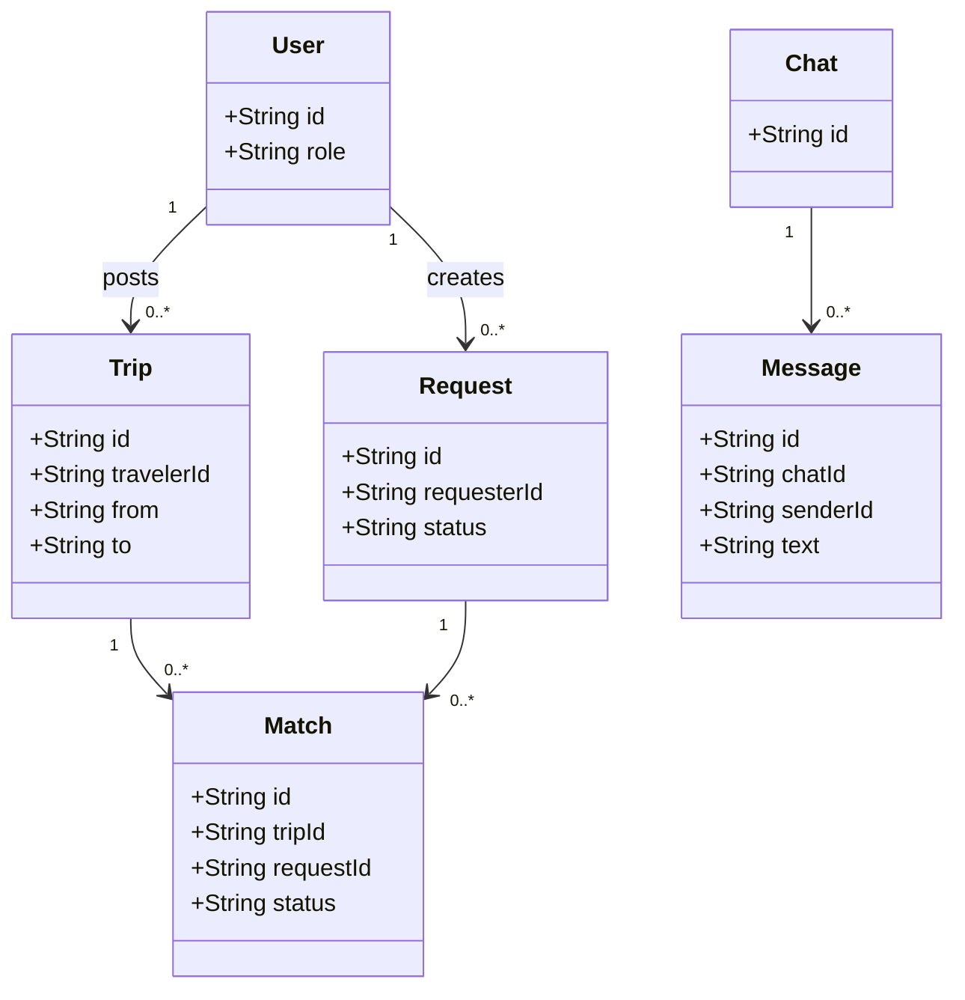
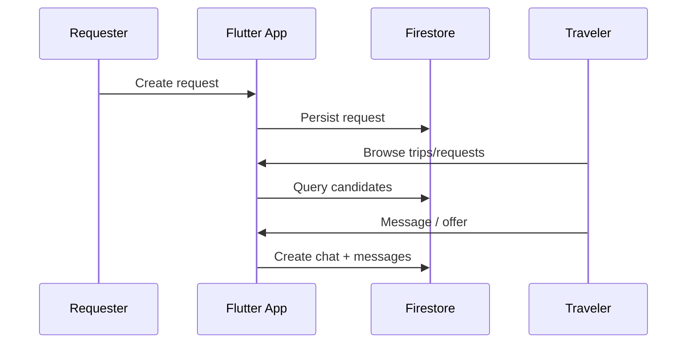

<div align="center">

# Diaspora Delivery

Senior-level Flutter + Firebase project: a peer-to-peer delivery platform that matches **delivery requests** with **real trips**, enabling secure coordination between diaspora communities and travelers.

[](https://flutter.dev/)
[](https://firebase.google.com/)
[](https://firebase.google.com/docs/functions)

</div>

## At a glance

- **Problem:** International shipping is expensive and slow; travelers often have unused baggage capacity.
- **Solution:** A request <-> trip matching platform with chat, notifications, and media uploads.
- **Engineering focus:** Clean Flutter architecture + scalable serverless backend + strong local dev workflow.

---

## What this repo contains

- `frontend/` - Flutter application
- `firebase/` - Firebase config + rules + emulators + Cloud Functions
- `docs/` - Requirements + architecture (SRS/SDA)

---

## Feature highlights

| Capability | Notes |
|---|---|
| Trips | Travelers can publish upcoming trips |
| Requests | Requesters can publish delivery requests |
| Matching | Request <-> trip matching logic |
| Chat | In-app messaging for coordination |
| Notifications | Event-driven notifications |
| Media uploads | Images/files stored via Firebase Storage |

---

## Demo / screenshots

This section is intentionally "ready" but won't show broken images.

1) Add screenshots under `docs/screenshots/`:

- `docs/screenshots/01_auth.png`
- `docs/screenshots/02_home.png`
- `docs/screenshots/03_trip_details.png`
- `docs/screenshots/04_chat.png`
- `docs/screenshots/05_profile.png`

2) Uncomment the table below:

<!--
| Auth | Home | Trip Details |
|---|---|---|
|  |  |  |

| Chat | Profile | Requests |
|---|---|---|
|  |  |  |
-->

---

## Tech stack

**Frontend**

- Flutter (Dart >= 3.0)
- State management: `flutter_bloc`
- Navigation: `go_router`
- Dependency injection: `get_it` + `injectable`

**Backend**

- Firebase Auth, Firestore, Storage
- Firebase Cloud Messaging (push)
- Cloud Functions (Node.js 18)

**Local dev**

- Firebase Emulator Suite (auth/firestore/functions/storage/pubsub + UI)

---

## Architecture diagrams

### System context



### Frontend layering



### Domain model (simplified)



### Example flow: request <-> trip coordination



---

## Getting started

### Prerequisites

- Node.js (for Firebase emulators / functions)
- Firebase CLI (optional; the repo scripts use `npx firebase-tools`)
- Flutter SDK (Dart >= 3.0)

> Windows is supported (this repo includes PowerShell-friendly scripts).

### Run backend locally (Firebase Emulator Suite)

From the repo root:

```bash
npm run install:functions
npm run serve:backend
```

This starts local emulators for Auth, Firestore, Functions, Storage, Pub/Sub, and the Emulator UI.

### Install and run the Flutter app

From `frontend/`:

```bash
cd frontend
flutter pub get
flutter run
```

If you use code generation (DI, adapters, etc.):

```bash
cd frontend
flutter pub run build_runner build --delete-conflicting-outputs
```

### Run Flutter against the emulators (recommended)

The app supports `--dart-define` flags (see `frontend/lib/main.dart`).

Android emulator:

```bash
cd frontend
flutter run --dart-define=USE_FIREBASE_EMULATORS=true --dart-define=FIREBASE_EMULATOR_HOST=10.0.2.2
```

Physical device (same WiFi): replace the host with your machine LAN IP.

```bash
cd frontend
flutter run --dart-define=USE_FIREBASE_EMULATORS=true --dart-define=FIREBASE_EMULATOR_HOST=192.168.1.10
```

---

## Testing

Flutter:

```bash
cd frontend
flutter test
```

Cloud Functions:

```bash
cd firebase/functions
npm test
```

---

## Security (high level)

- Firestore rules: `firebase/firestore.rules`
- Storage rules: `firebase/storage.rules`

Guiding principle: keep client access minimal via rules, and enforce privileged or cross-document logic in Cloud Functions.

---

## Repository layout

```text
.
├─ frontend/                 Flutter app
│  └─ lib/
│     ├─ config/             routing + dependency injection
│     ├─ core/               shared utilities/services/widgets
│     └─ features/           feature modules (auth, chat, trips, ...)
├─ firebase/                 Firebase config + rules + emulators
│  ├─ functions/             Cloud Functions (Node.js 18)
│  ├─ firestore.rules
│  └─ storage.rules
└─ docs/                     SRS/SDA and supporting documentation
```

---

## Documentation

- Requirements + architecture: `docs/Diaspora_Peer_Delivery_SRS_SDA_v1.0.0.md`

---

## Roadmap (nice-to-have)

- CI (lint + tests) via GitHub Actions
- Deep links + improved onboarding
- More robust matching and dispute handling
- Observability (structured logging) for Cloud Functions

---

## Repo structure

- `frontend/` — Flutter application
- `firebase/` — Firebase config, security rules, emulators, Cloud Functions
- `docs/` — Requirements and architecture documentation

---

## Contributing

- Keep changes scoped and add tests where practical.
- Follow existing patterns for feature modules (`frontend/lib/features`).
- Prefer running against the emulator suite for development.

---

## License

If you plan to publish this repository, add a LICENSE file and update this section.
