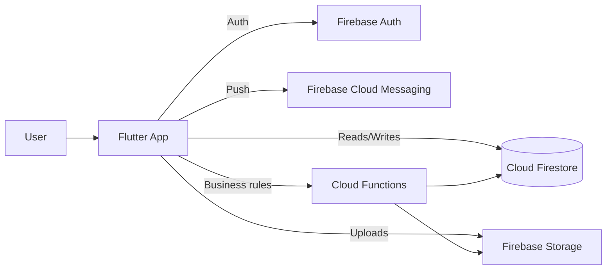
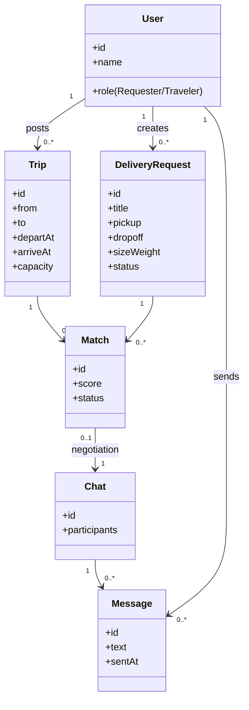
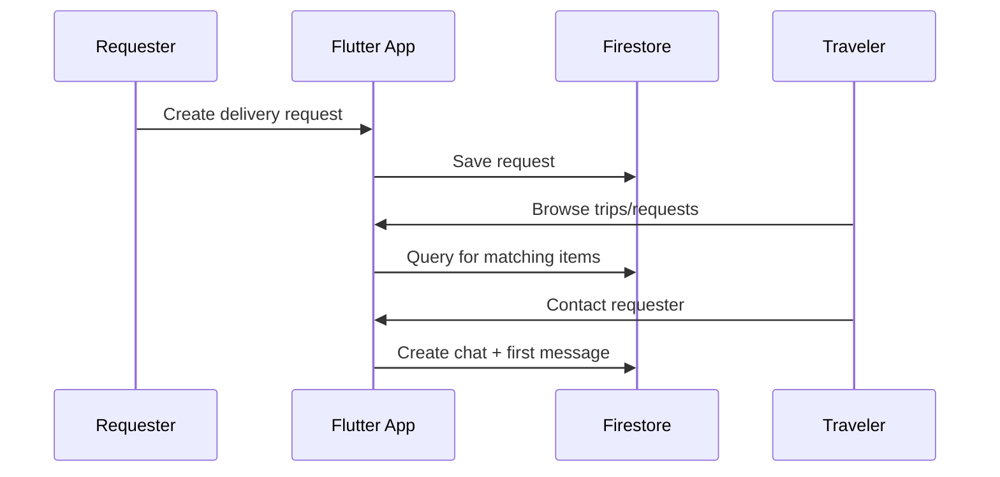
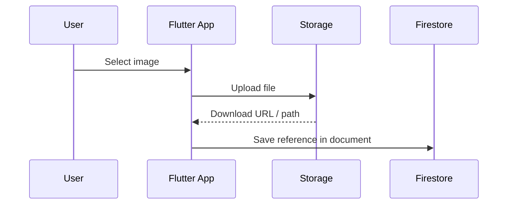

<div align="center">

# Diaspora Delivery

**Diaspora Peer Delivery Mobile Application**

Match **delivery requests** to **real trips** and enable safe, organized coordination between **Requesters** and **Travelers**.

[](https://flutter.dev/)
[](https://firebase.google.com/)
[](https://firebase.google.com/docs/functions)

</div>

---

## Why this project exists

International shipping can be **expensive** and **slow**, while travelers often have **unused baggage capacity**. Diaspora Delivery turns that gap into a coordinated workflow:

- Requesters post what they need delivered
- Travelers post trips they’re already taking
- The platform matches the two, supports messaging/updates, and enforces guardrails (rules + validations)

---

## What this repo demonstrates (senior-level signals)

- **Clean app architecture** (feature-first structure, BLoC, dependency injection)
- **Serverless backend design** (Firebase rules + Cloud Functions for business logic)
- **Local dev experience** (Firebase Emulator Suite + repeatable scripts)
- **Product documentation** (SRS/SDA) showing end-to-end reasoning

---

## Table of contents

- [Features](#features)
- [Tech stack](#tech-stack)
- [Architecture](#architecture)
  - [System context](#system-context)
  - [Frontend layering](#frontend-layering)
  - [Domain model (simplified)](#domain-model-simplified)
  - [Key flows](#key-flows)
- [Quickstart](#quickstart)
- [Repo map](#repo-map)
- [Screenshots / demo](#screenshots--demo)
- [Documentation](#documentation)
- [Roadmap](#roadmap)

---

## Features

| Area | What’s included |
|---|---|
| Auth & identity | Sign-in, user profiles |
| Marketplace | Trips and delivery requests |
| Matching | Suggest/request ↔ trip fit |
| Communication | In-app chat + notifications |
| Media | Upload images/documents to storage |
| Trust | Ratings/reviews and verification ideas (project scope) |

---

## Tech stack

- **Frontend:** Flutter (Dart ≥ 3.0), `flutter_bloc`, `go_router`, `get_it` + `injectable`
- **Backend:** Firebase Auth, Firestore, Storage, FCM
- **Server logic:** Cloud Functions (Node.js 18)
- **Dev tooling:** Firebase Emulator Suite (Auth/Firestore/Functions/Storage/PubSub)

---

## Architecture

### System context



### Frontend layering

```mermaid
flowchart TB
  UI[Presentation\nScreens & Widgets] --> SM[BLoC / Cubit\nState + Events]
  SM --> REPO[Repositories / Services\nUse-cases + adapters]
  REPO --> SDK[Firebase SDK]\n
  REPO --> CORE[Core\nErrors • Theme • Utils • Widgets]
```

### Domain model (simplified)

This is a conceptual view (not a strict schema export), meant to make the system easy to understand.



### Key flows

#### Flow 1 — Create request → traveler finds → chat



#### Flow 2 — Upload media (item image)



---

## Quickstart

> Windows is supported (PowerShell-friendly scripts are included).

### 1) Start Firebase Emulator Suite (backend)

From the repo root:

```bash
npm run install:functions
npm run serve:backend
```

This starts local emulators for Auth, Firestore, Functions, Storage, Pub/Sub, plus the Emulator UI.

### 2) Run the Flutter app

```bash
cd frontend
flutter pub get
flutter run
```

Tip: the app supports emulator flags via `--dart-define` (see `frontend/lib/main.dart`).

---

## Repo map

- `frontend/` — Flutter application
- `firebase/` — Firebase config, security rules, emulators, Cloud Functions
- `docs/` — Requirements and architecture documentation

---

## Screenshots / demo

Recruiters love visuals. Add screenshots and/or a 30–60s demo GIF:

- Put files under `docs/screenshots/`
- See `docs/screenshots/README.md` for suggested filenames

---

## Documentation

- SRS/SDA (requirements + architecture): `docs/Diaspora_Peer_Delivery_SRS_SDA_v1.0.0.md`

---

## Roadmap

- CI (lint + tests) via GitHub Actions
- Stronger matching (constraints + scoring explainability)
- Better trust signals (verification, dispute handling)
- Observability (structured logs + error reporting) for Cloud Functions
