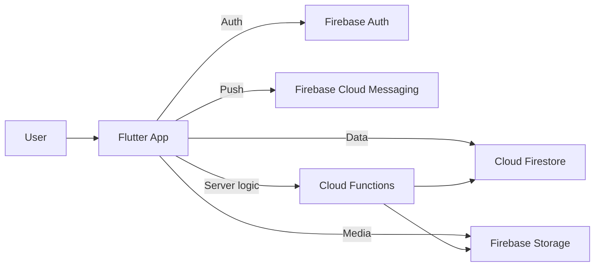
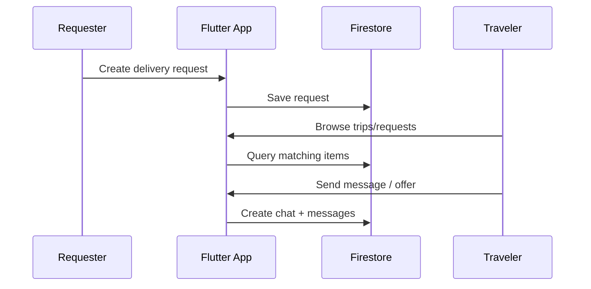

<div align="center">

# Diaspora Delivery — Diaspora Peer Delivery Mobile Application

A mobile peer-to-peer delivery platform that connects diaspora members who want to send items to Ethiopia (**Requesters**) with travelers already going (**Travelers**).

[](https://flutter.dev/)
[](https://firebase.google.com/)
[](https://nodejs.org/)

</div>

## Recruiter TL;DR

- **Problem:** international shipping is expensive/slow; travelers often have unused baggage capacity.
- **Solution:** match **delivery requests** to **real trips**, enable **in-app coordination**, and support **trust & accountability**.
- **Built with:** Flutter + Firebase (Auth/Firestore/Storage/FCM) + Cloud Functions.

---

## Highlights

What this project demonstrates:

- **End-to-end product thinking** (requirements, architecture, and implementation)
- **Modern Flutter architecture** (feature-first structure + BLoC + DI)
- **Serverless backend** with Firebase rules + Cloud Functions for business logic
- **Local development workflow** with Firebase Emulator Suite

---

## Features

- Authentication & user profiles
- Trips and delivery requests
- Matching (requests ↔ trips)
- In-app chat and notifications
- Media uploads (e.g., item images)
- Ratings/reviews and trust-building mechanisms (project scope)

---

## Screenshots (add yours)

Add 3–6 screenshots or a short demo GIF/video to make this pop for recruiters.

Suggested files (create and commit when ready):

- `docs/screenshots/01_auth.png`
- `docs/screenshots/02_home.png`
- `docs/screenshots/03_trip_details.png`
- `docs/screenshots/04_chat.png`
- `docs/screenshots/05_profile.png`

Example layout:

| Auth | Home | Trip details |
|---|---|---|
| `docs/screenshots/01_auth.png` | `docs/screenshots/02_home.png` | `docs/screenshots/03_trip_details.png` |

| Chat | Profile | Requests |
|---|---|---|
| `docs/screenshots/04_chat.png` | `docs/screenshots/05_profile.png` | `docs/screenshots/06_requests.png` |

---

## Repo map

- Flutter app: `frontend/` (start here: `frontend/README.md`)
- Firebase backend: `firebase/` (functions/rules/emulators)
- Product documentation (SRS/SDA): `docs/Diaspora_Peer_Delivery_SRS_SDA_v1.0.0.md`

---

## Tech stack

- **Frontend:** Flutter (Dart), BLoC (`flutter_bloc`), `go_router`
- **Backend:** Firebase Auth, Firestore, Storage, FCM
- **Server logic:** Cloud Functions (Node.js 18)
- **Dev tooling:** Firebase Emulator Suite

---

## Architecture (at a glance)



### Example flow: requester and traveler coordination



---

## Getting started

### Prerequisites

- Node.js (for Firebase emulators / functions)
- Firebase CLI (optional; the repo scripts use `npx firebase-tools`)
- Flutter SDK (Dart >= 3.0)

> Windows is supported (this repo includes PowerShell-friendly scripts).

### Run backend locally (Firebase Emulator Suite)

From the repo root:

```bash
npm run install:functions
npm run serve:backend
```

This starts local emulators for Auth, Firestore, Functions, Storage, Pub/Sub, and the Emulator UI.

### Run the Flutter app

```bash
cd frontend
flutter pub get
flutter run
```

For emulator-friendly Flutter run commands, see `frontend/README.md`.

---

## Documentation

- Requirements + architecture: `docs/Diaspora_Peer_Delivery_SRS_SDA_v1.0.0.md`
- Flutter app docs: `frontend/README.md`

---

## Roadmap (nice-to-have)

- CI (lint + tests) via GitHub Actions
- Deep links + improved onboarding
- More robust matching and dispute handling
- Observability (structured logging) for Cloud Functions

---

## Repo structure

- `frontend/` — Flutter application
- `firebase/` — Firebase config, security rules, emulators, Cloud Functions
- `docs/` — Requirements and architecture documentation

---

## Contributing

- Keep changes scoped and add tests where practical.
- Follow existing patterns for feature modules (`frontend/lib/features`).
- Prefer running against the emulator suite for development.

---

## License

If you plan to publish this repository, add a LICENSE file and update this section.
