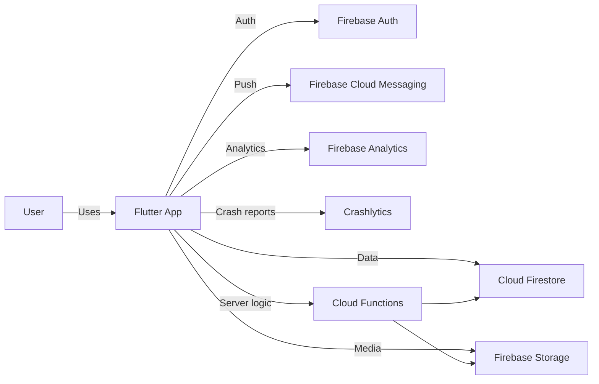

<div align="center">

# Diaspora Delivery (Flutter App)

Peer-to-peer delivery platform connecting diaspora community members who want to send items to Ethiopia (**Requesters**) with travelers already going (**Travelers**).

[](https://flutter.dev/)
[](https://firebase.google.com/)

</div>

> This folder contains the Flutter frontend.

---

## Table of contents

- [Overview](#overview)
- [Tech stack](#tech-stack)
- [App architecture](#app-architecture)
- [Project structure](#project-structure)
- [Getting started](#getting-started)
	- [Prerequisites](#prerequisites)
	- [Install](#install)
	- [Run](#run)
	- [Run with Firebase Emulator Suite](#run-with-firebase-emulator-suite)
- [Build](#build)
- [Testing](#testing)
- [Localization (i18n)](#localization-i18n)
- [Troubleshooting](#troubleshooting)

---

## Overview

**Diaspora Delivery** is a Flutter mobile app that supports:

- Trip posting and delivery request posting
- Matching requests to suitable trips
- In-app chat and notifications
- Profiles, ratings/reviews, and trust-building features

For full requirements and architecture documentation, see the main SRS/SDA document in the repo root: `docs/Diaspora_Peer_Delivery_SRS_SDA_v1.0.0.md`.

---

## Tech stack

- **Flutter** (Dart SDK >= 3.0)
- **State management:** BLoC (`flutter_bloc`)
- **Navigation:** `go_router`
- **Firebase:** Auth, Firestore, Storage, Messaging, Analytics, Crashlytics
- **DI:** `get_it` + `injectable`

---

## App architecture

At a high level, the app follows a feature-first structure with shared core utilities.

### System context



### Frontend layering (typical)

```mermaid
flowchart TB
	UI[Presentation (Screens/Widgets)] --> BLoC[BLoC / Cubit]
	BLoC --> SVC[Services / Repositories]
	SVC --> FB[(Firebase SDK)]
	SVC --> CORE[Core (errors, utils, theme, widgets)]
```

---

## Project structure

Key folders:

- `lib/app.dart` – app root widget
- `lib/main.dart` – app entrypoint
- `lib/config/` – routing + dependency injection
- `lib/core/` – shared constants, services, utilities, widgets
- `lib/features/` – feature modules (auth, chat, trips, requests, etc.)
- `lib/l10n/` – localization ARB files

---

## Getting started

### Prerequisites

- Flutter SDK (Dart >= 3.0)
- Android Studio / Android SDK (for Android) and/or Xcode (for iOS)
- A Firebase project configured for the app (this repo includes generated `lib/firebase_options.dart`)

### Install

From this folder (`frontend/`):

```bash
flutter pub get
```

If you use code-generation (DI, Hive adapters, etc.):

```bash
flutter pub run build_runner build --delete-conflicting-outputs
```

### Run

```bash
flutter run
```

### Run with Firebase Emulator Suite

If you want to run against local emulators (recommended for development), start the emulator suite from the repo root:

```bash
npm run serve:backend
```

Then run the Flutter app normally:

```bash
flutter run
```

This app supports emulator configuration via `--dart-define` (see `lib/main.dart`):

**Android emulator (recommended):**

```bash
flutter run \
	--dart-define=USE_FIREBASE_EMULATORS=true \
	--dart-define=FIREBASE_EMULATOR_HOST=10.0.2.2
```

**Physical device on same Wi‑Fi:** replace the host with your machine LAN IP (example `192.168.1.10`).

```bash
flutter run \
	--dart-define=USE_FIREBASE_EMULATORS=true \
	--dart-define=FIREBASE_EMULATOR_HOST=192.168.1.10
```

---

## Build

Android release:

```bash
flutter build apk --release
```

iOS release (requires macOS):

```bash
flutter build ios --release
```

---

## Testing

```bash
flutter test
```

---

## Localization (i18n)

This project uses Flutter localization generation.

- ARB files live in `lib/l10n/` (e.g., `app_en.arb`, `app_am.arb`).
- Ensure `flutter: generate: true` remains enabled in `pubspec.yaml`.

---

## Troubleshooting

- **Android build fails after pulling**: re-sync Gradle and run `flutter clean` then `flutter pub get`.
- **Firebase config mismatch**: verify `android/app/google-services.json` and `lib/firebase_options.dart` match the intended Firebase project.
- **Emulator connectivity**:
	- Android emulator: `10.0.2.2` maps to host `localhost`.
	- Physical device: use your LAN IP for emulator hosts.
